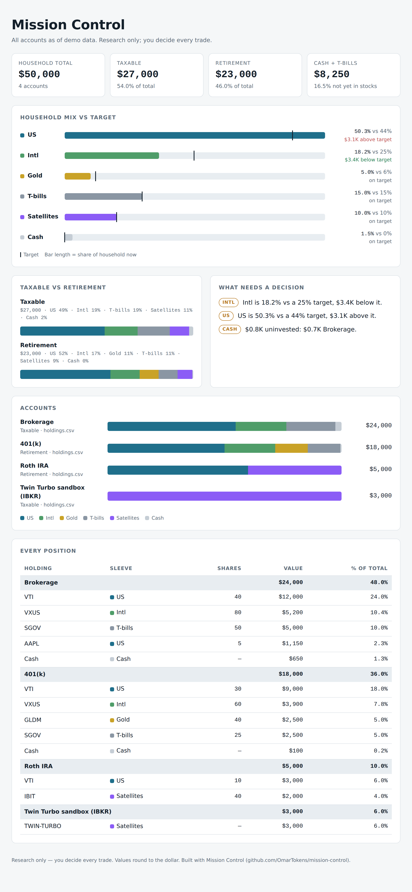

# 🗺️ MISSION CONTROL: one view of every account you own

### *Claude Cowork 🤝 Google Sheets · 📊 a live tracker, 🖼️ a one-glance snapshot, 📬 a daily note from your own research agent.*

**Mission Control** gives you a household dashboard: every account, every position, your mix vs your targets, a value sleeve, a watchlist that flags bargains, and a daily log. Claude keeps it current, builds a snapshot picture of your whole portfolio, and emails you what needs a decision.
**You make every trade yourself.** The agent only does research. 🔒

> 🧪 **Everything in this repo is demo data.** The accounts, balances and positions are made up. Swap in your own in about 15 minutes.

## 👀 What it looks like (demo data)



**[🖼️ Live demo page →](docs/demo/snapshot.html)** · **[📊 Demo tracker (.xlsx) →](docs/demo/Mission-Control-Tracker-demo.xlsx)** · **[📬 Email block →](docs/demo/snapshot_email.html)**

---

## 🧩 What you get

| Piece | What it does | File |
|---|---|---|
| 📊 **Tracker** | Google Sheet with 7 tabs: Dashboard · Holdings · Value Sleeve · Watchlist · Daily Log · History · Control Center. Prices are live (GOOGLEFINANCE). The only numbers you type are shares and average cost. | `tracker/build_tracker.py` |
| 🧰 **Sheet helpers** | Adds charts, a Mission Control menu, and an "inbox" so your agent can write a daily note into the sheet. No web app, no IDs, no tokens. | `tracker/apps_script/MissionControl.gs` |
| 🖼️ **Snapshot** | A one-page picture of the whole household (the image above) plus an email-safe version for the top of each daily email. | `snapshot/build_snapshot.py` |
| 🤖 **Agent prompts** | Setup, twice-daily scan, Friday weekly. Paste them into Claude Cowork. | `prompts/` |
| 🎚️ **Target presets** | Starting mixes, including ones that match Value Cruiser and Twin Turbo. | `demo/targets.csv`, `presets/` |

### The tracker tabs

| Tab | What's on it |
|---|---|
| 🏠 **Dashboard** | Total, taxable vs retirement, cash + T-bills, unrealized gain, latest scan, mix vs target with gap $, accounts, watchlist counts, 4 charts |
| 📋 **Holdings** | One row per position per account. Yellow cells are yours (shares, avg cost). |
| 💎 **Value Sleeve** | Beaten-down quality names you review monthly: price vs 52-week high, P/E, status (IN ZONE · NEAR · HARVEST?), what you own |
| 🔭 **Watchlist** | ~140 names with VALUE ZONE / WATCH flags from your own dials |
| 📝 **Daily Log** | Every scan leaves a row: headline, ideas, buy zones, rebalance & tax, risks |
| 📈 **History** | One row per day; you vs a benchmark, start = 100 |
| 🎛️ **Control Center** | Your target mix, drift band, value-zone dials, satellite cap, exclusions, glossary |

---

## ⚡ Launch sequence (about 15 min)

| Step | Do this |
|---|---|
| 1️⃣ 🔌 | **Connect** in Claude (Settings → Connectors): **Google Drive** (to read the sheet), **Gmail** (for the email; optional), and **Claude in Chrome** (to write notes into the sheet; optional) |
| 2️⃣ 🗂️ | **Create a Cowork project.** Name it after your agent. |
| 3️⃣ 📋 | **Paste this** into a new session: *"Set me up from https://github.com/OmarTokens/mission-control. Follow prompts/setup.md. Research only, no trades."* |
| 4️⃣ 📤 | **Upload** the .xlsx it gives you to Google Drive → open with Google Sheets → Extensions → Apps Script → paste `MissionControl.gs` → Save → reload → **Mission Control → Set up charts** |
| 5️⃣ ⏰ | **Say "schedule it."** Weekday scans after the open and after the close, plus a Friday weekly. |

<details>
<summary><b>🛠️ Prefer to run it yourself?</b></summary>

```bash
pip install openpyxl playwright        # playwright only for the PNG
python3 tracker/build_tracker.py                                   # demo tracker -> out/Mission-Control-Tracker.xlsx
python3 snapshot/build_snapshot.py --csv demo/holdings.csv --targets demo/targets.csv \
        --out out/snapshot.html --png out/snapshot.png             # demo snapshot

# your own data: copy demo/*.csv into my_data/ (git-ignored), edit, then
python3 tracker/build_tracker.py --dir my_data --out out/my-tracker.xlsx --agent "Max"
python3 snapshot/build_snapshot.py --xlsx exported-sheet.xlsx --out out/snapshot.html   # from your live sheet
```
</details>

---

## 🔗 Plug in the other agents

Mission Control is the **map**. The other two are **engines** you can bolt on.

| Agent | What it is | How it shows up here |
|---|---|---|
| 🛳️ **[Value Cruiser](https://github.com/OmarTokens/value-cruiser)** | Calm long-term core (5 funds at fixed weights) + a small value sleeve, rebalanced on drift | Use `presets/targets-value-cruiser.csv` as your targets. Its value picks go on the **Value Sleeve** tab. Its Friday logbook line goes in the weekly email. |
| 🏎️ **[Twin Turbo](https://github.com/OmarTokens/twin-turbo-trader)** | Fast momentum sandbox in a small separate account | Add it as **one Holdings row** (ticker `TWIN-TURBO`, sleeve Satellites, shares = account value). It counts toward your satellite cap. Its rules stay in its own repo. |

```
              ┌──────────────────────────┐
              │   🗺️  MISSION CONTROL     │  every account · mix vs target · daily note
              └────────────┬─────────────┘
          core targets  ◄──┴──►  one satellite row
     🛳️ Value Cruiser               🏎️ Twin Turbo
   (long-term, ~10 trades/yr)    (sandbox, ~4 trades/week)
```

---

## 🎛️ Talk to it

| If… | Say |
|---|---|
| 👀 Quick picture | `snapshot` |
| 🧾 You traded | `filled: bought 2 VTI at 300 in Roth IRA` (or send a cropped screenshot) |
| 💸 New money | `new cash 1000 in Brokerage` |
| 🎚️ Change a dial | `set Gold target to 7%` (it shows the impact first) |
| 💎 Value ideas | `explain <TICKER>` · `what's in the value zone?` |
| 🔇 Quieter emails | `email only when something needs a decision` |

---

## 🔒 Privacy by design

- **Your data never goes in this repo.** `my_data/` and `out/` are git-ignored.
- **Nicknames, not account numbers.** Crop screenshots; the agent never stores account numbers.
- **No public endpoint.** The Apps Script is bound to your own sheet; no web app, no token.
- **`tools/leak_check.py`** scans a folder for names, emails, IDs and dollar figures you list before you publish a fork.

---

## ⚖️ The fine print

*Short version: this is a free, do-it-yourself template. You run it, you decide, you own the results.*

- **Not financial advice.** Everything here, and everything the agent produces, is for **educational and informational purposes only**. Not investment, tax, or legal advice, and not a recommendation to buy or sell any security. Tickers in the demo are examples.
- **Not an adviser.** The author is not a registered investment adviser, broker-dealer, tax adviser, or financial planner.
- **You decide.** You place every order yourself and are solely responsible for the results.
- **AI makes mistakes.** Agents can misread a screenshot or use a stale price. **Check every number before you trade.**
- **Taxes are yours.** The agent only *flags* possible issues (gains, holding periods, wash sales). Ask a tax professional.
- **No warranty.** Provided "as is" under the MIT license. The author is not liable for any loss.
- **Not affiliated** with Anthropic, Google, Interactive Brokers, or any fund issuer. Product names are trademarks of their owners.

---

*🗺️ Make it yours: rename the agent, set your targets, trim the watchlist. Then let the map tell you where you are.*
